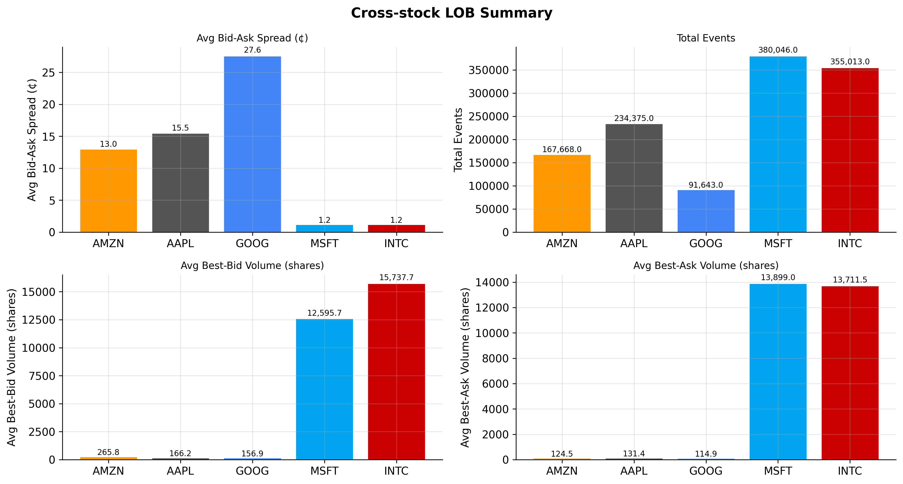
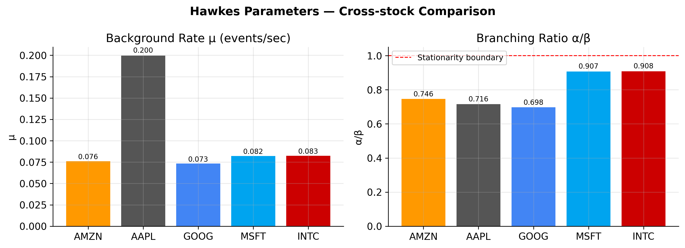
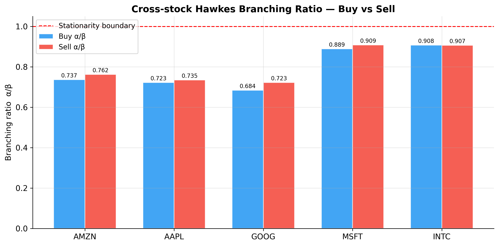
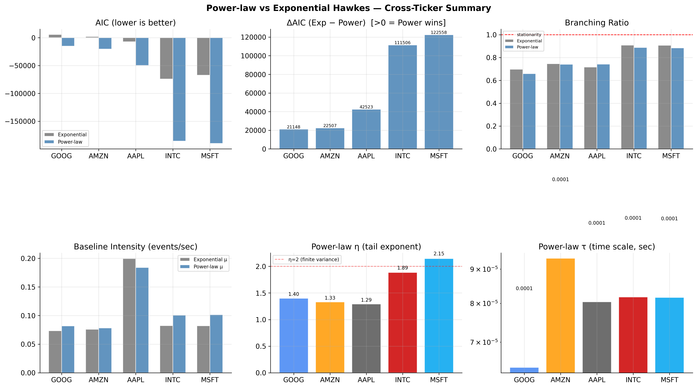
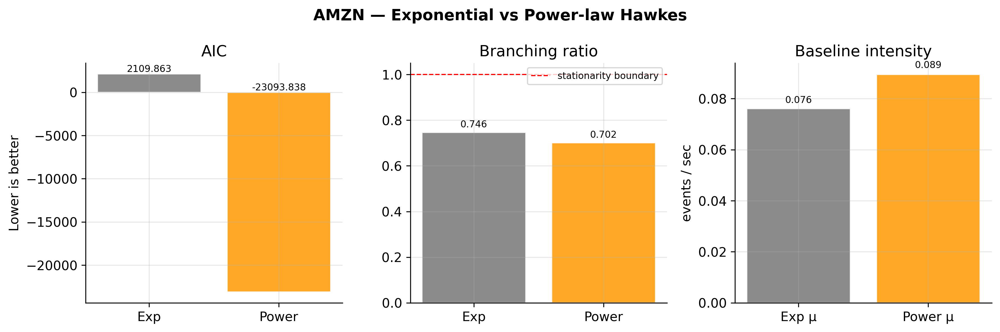
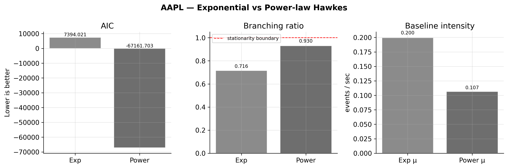
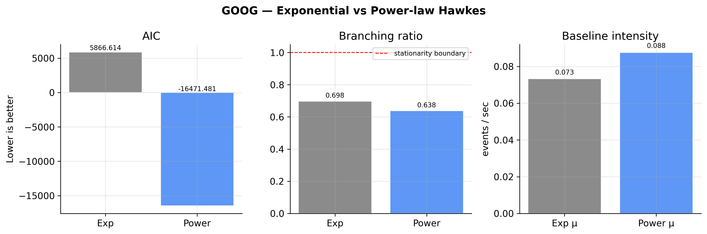
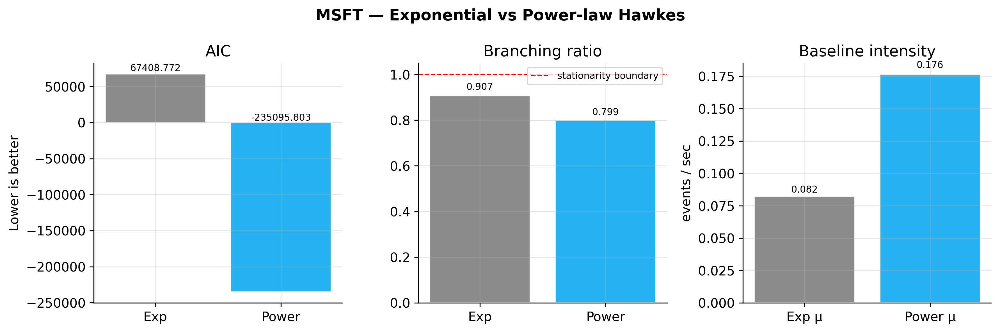
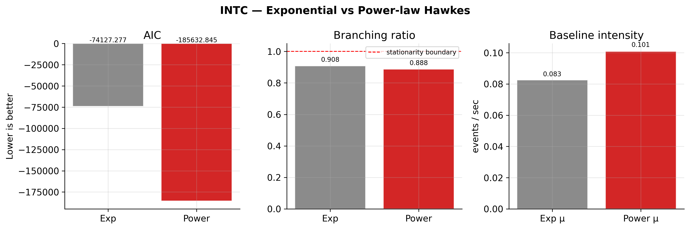

# Hawkes Processes for Limit Order Book Events

MSc mini-project fitting Hawkes process models to LOBSTER market-microstructure data.

Based on the original code by [@konqr](https://github.com/konqr/UoE_LOBHawkes), as part of the LOB Hawkes presentation.

---

## Project Structure

```
├── main.py                   # Core analysis: LOB visualisation, stylised facts, exponential Hawkes fit
├── stylised_facts.py         # Multi-distribution inter-arrival fitting (Exp, Burr-XII, GenGamma, Mittag-Leffler)
├── experiment_2.py           # Experiment 2: directional asymmetry (buy vs sell Hawkes fits)
├── power_hawkes.py           # Experiment 3: power-law Hawkes kernel fit and AIC comparison
├── kernel_sum_exp.py         # Sum-of-K-exponentials kernel model selection (K ∈ {1,2,3,5,8})
├── main-original.py          # Archived original version of main.py (for reference)
├── requirements.txt          # Python dependencies
├── LOBH-slides.pdf           # Presentation slides from the LOB Hawkes talk
│
├── data/                     # LOBSTER CSV data files
│   └── data.zip              # Unzip here to populate the data folder
│
└── plots/                    # All output figures (auto-created on first run)
    ├── main/
    ├── experiment_2/
    ├── power_hawkes/
    ├── kernel_sum_exp/
    └── stylised_facts_multi_dist/
```

---

## Setup

```bash
pip install -r requirements.txt
cd data && unzip data.zip
```

Dependencies: `numpy`, `scipy`, `pandas`, `matplotlib`, `statsmodels`, `numba`, `joblib`, `rich` (optional — progress bars).

LOBSTER data available at: https://lobsterdata.com/info/DataSamples.php

---

## Configuration

Edit the three lines near the top of `main.py` before running anything — all other scripts import from it:

```python
DATA_PATH  = "data/"       # folder containing LOBSTER CSV files
START_DATE = "2012-06-21"  # first date to load (YYYY-MM-DD)
END_DATE   = "2012-06-21"  # last  date to load (YYYY-MM-DD)
```

---

## Running

Run all scripts from the project root. Suggested order:

| Script | function |
|---|---|
| `python main.py` | LOB visualisation, stylised facts, exponential Hawkes fit |
| `python stylised_facts.py` | Inter-arrival distribution fitting and AIC model selection |
| `python experiment_2.py` | Buy vs sell asymmetry — separate Hawkes fits, branching ratio comparison |
| `python power_hawkes.py` | Power-law kernel fit (Numba-accelerated), AIC vs exponential |
| `python kernel_sum_exp.py` | Sum-of-exponentials kernel, AIC/BIC model selection across K |

---

## Results

### LOB Market Microstructure



### Exponential Hawkes Fit — Cross-stock



### Experiment 2 — Buy vs Sell Asymmetry



### Experiment 3 — Power-law Kernel

KS statistic (lower = better fit) for exponential vs power-law Hawkes across all stocks. ★ marks the better-fitting model.

| Model | AMZN | AAPL | GOOG | MSFT | INTC |
|---|---|---|---|---|---|
| Exp | 0.325 | 0.317 | 0.385 | 0.294 | 0.244 |
| Power-law | **0.086**★ | **0.072**★ | **0.075**★ | **0.190**★ | **0.173**★ |
| ΔKS | −0.239 | −0.245 | −0.310 | −0.104 | −0.071 |



Per-stock AIC, branching ratio, and baseline intensity comparison:

<p>
  
  
</p>
<p>
  
  
</p>
<p>
  
</p>
